# wavekat-brand

Brand assets, design system, and social preview banners for WaveKat repositories.

## Assets

### Banners (1280 x 640)

GitHub social preview images.

| Repo | Preview |
|------|---------|
| wavekat-vad | 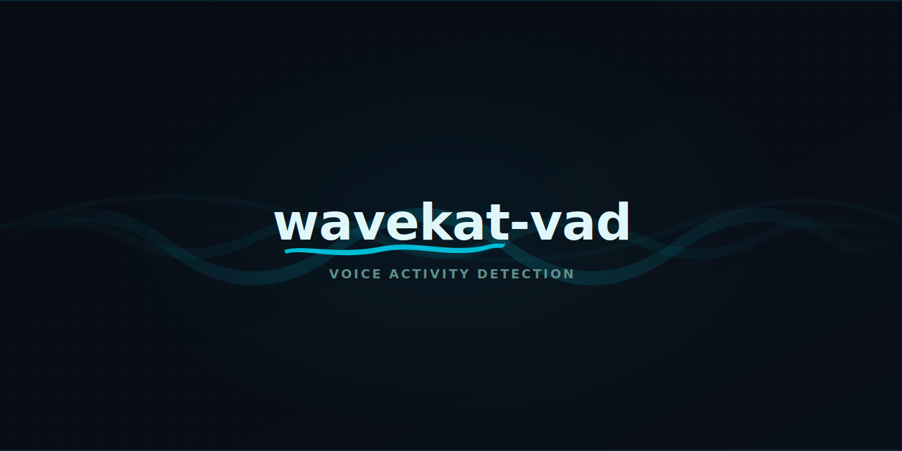 |
| wavekat-voice | 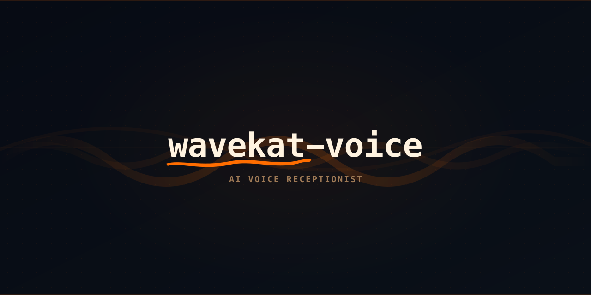 |
| wavekat-turn | 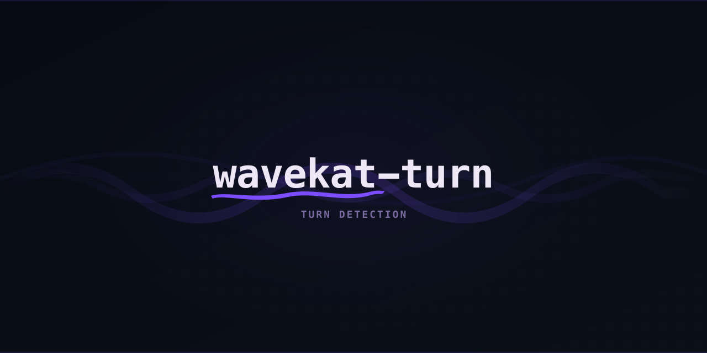 |
| wavekat-core | 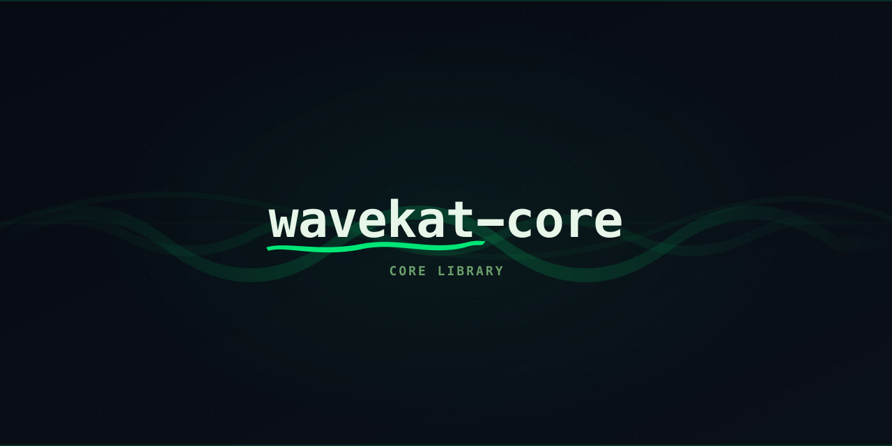 |
| wavekat-lab | 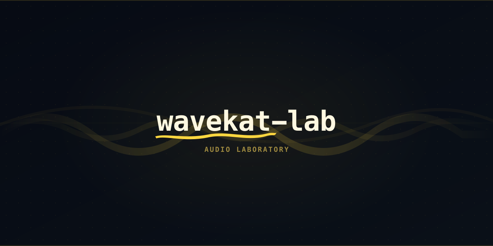 |

### Narrow Banners (1280 x 320)

README header images.

| Repo | Preview |
|------|---------|
| wavekat-vad | 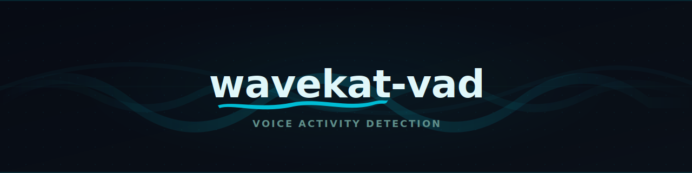 |
| wavekat-voice | 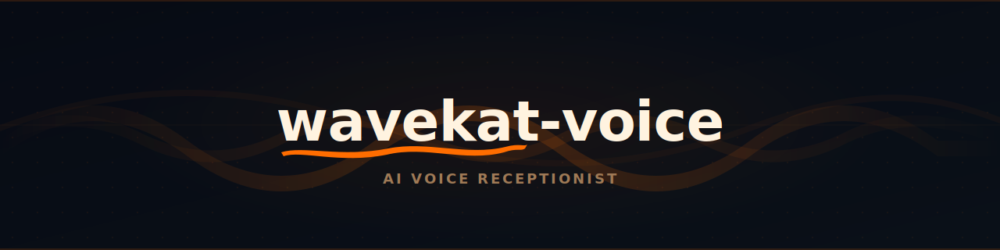 |
| wavekat-turn |  |
| wavekat-core | 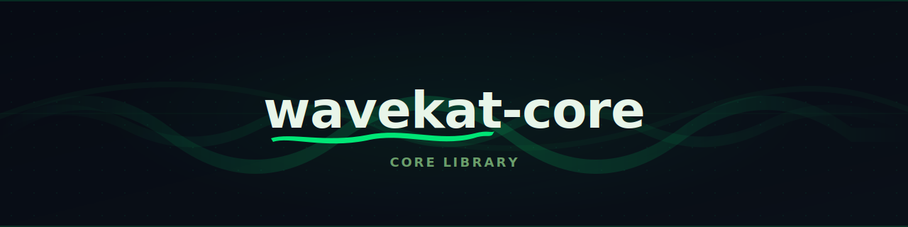 |
| wavekat-lab | 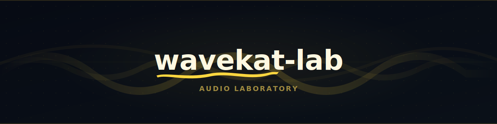 |

### Wordmark (288 x 72)

Main wavekat wordmark with signature ribbon.

| Variant | Preview |
|---------|---------|
| Light |  |
| Dark |  |

### Logos (640 x 160)

Repo logos in dark and light variants.

| Repo | Light | Dark |
|------|-------|------|
| wavekat-vad | 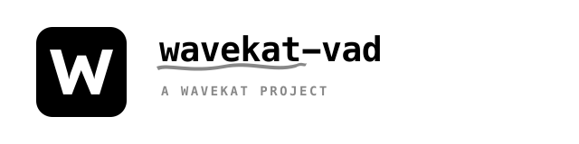 |  |
| wavekat-turn | 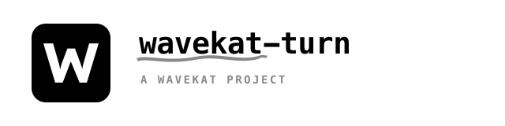 |  |

### Icons (256 x 256)

Standalone W mark for favicons, app icons, etc.

| Variant | Preview |
|---------|---------|
| Light |  |
| Dark |  |

### Templates

| File | Purpose |
|------|---------|
| [`assets/template.svg`](assets/template.svg) | Banner template with placeholders |
| [`assets/narrow-template.svg`](assets/narrow-template.svg) | Narrow banner template (4:1 ratio) |
| [`assets/logo-template.svg`](assets/logo-template.svg) | Logo template with placeholders |
| [`assets/icon-template.svg`](assets/icon-template.svg) | Icon template with placeholders |
| [`assets/wordmark-template.svg`](assets/wordmark-template.svg) | Wordmark template (4:1 ratio) |
| [`assets/w.svg`](assets/w.svg) | W letterform path |

## Generate PNGs

```sh
make png    # convert all SVGs to PNG
make clean  # remove generated PNGs
```

Requires `rsvg-convert` (`brew install librsvg`).
